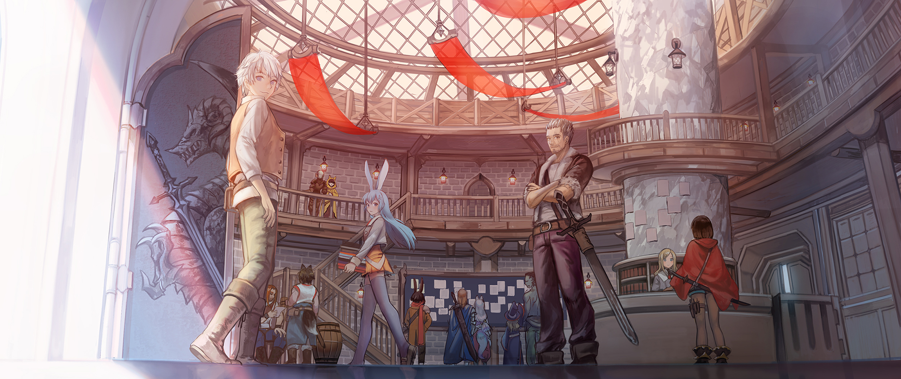

## Entrega 2 - ORM Spring - Hito 2

La primera demo fue un éxito y todos los testers están encantados con el sistema de juego.
Algunos de los reviews recibidos fueron:

- "Simple... pero profundo" -  Hideo Kojima

- "120 de 100" - IGN

Arman una gran celebración por el inmediato éxito con papas fritas, chizitos, gaseosa y sombreros graciosos.
Todos los desarrolladores e ingenieros atienden y comienzan a despotricarse, pero de pronto, la música se corta y las luces se apagan.
Una singular luz se prende, iluminando al CEO de la empresa, quien con una poderosa voz anuncia:

"Nuestra aventura... sólo acaba de comenzar"

Todos emocionados y con lágrimas en los ojos, lanzan los sombreros y se internan frenéticamente en sus escritorios, listos para continuar el desarrollo de lo que puede llegar a ser... el más grande y significante juego de la historia.

## Funcionalidad

Los testers, si bien contentos, mencionaron que los ayudaría tener acceso a ciertos datos que les permitan mejorar sus estrategias y que sea más fácil ordenar sus parties y aventureros.

Nuestro objetivo para esta próxima iteración es proveer esos datos para que el equipo del front los visualice.

  

### Cambios en PeleaService
- Cuando se finaliza una pelea, ahora nos interesa marcar quien gano y quien perdio la pelea.
- Cada vez que se resuelve un turno y se genera una nueva habilidad, hay que guardar esa habilidad en la pelea.
- Cada vez que se recibe una habilidad, hay que guardar esa habilidad en la pelea.

## Servicios

### PartyService

Nos interesa recopilar información sobre las mejores partys de aventureros para hacer análisis de datos sobre ello luego. Para eso deberemos implementar el siguiente servicio que hará uso de paginación para mostrar los datos más cómodamente en el front.

Para todos los métodos se pedirá una página, y una dirección que puede ser : ASCENDENTE o DESCENDENTE

- `recuperarOrdenadas(orden:Orden, direccion:Direccion, pagina:Int?):PartyPaginadas` - Devuelve las parties ordenadas en la en la dirección paginadas de a 10. 
  Las parties se pueden ordenar por: poder, victorias o derrotas.  
  `Poder`: La suma de _daño físico_ + _poder mágico_ + _precisión física_ de todos sus aventureros. 
  `Victorias`: La suma de peleas ganadas que tenga la party. 
  `Derrotas`: La suma de peleas perdidas que tenga la party.  
  La `direccion` puede ser: ascendente o descendente. 

Un ejemplo: `recuperarOrdenadas(PODER, DESCENDENTE, 0)`: Devuelve las primeras 10 parties con más poder. 
La respuesta es un objeto del tipo `PartyPaginadas` que tiene la lista de parties y el total de parties disponibles.

###  PeleaService

- `recuperarOrdenadas(partyId:Int, pagina:Int?):PeleasPaginadas` - Devuelve las peleas de una party ordenadas de la mas reciente a la mas vieja de forma paginada de a 10.

### Integracion a Spring
Además, en para poder hacer uso del front, nos interesara:

- Pasar la transaccionalidad de todos los servicios a Spring
- Que los DAOs implementen la interfaz de Spring 'CrudRepository' en lugar del DAO genérico previsto en el TP anterior.
- Crear controllers REST para todos los servicios implementados hasta ahora y los implementados en este TP también.
- Se implementen los DTO que les daremos, para generar un contrato de comunicación con el front.

### Se pide:

- Que provean implementaciones para las interfaces descriptas anteriormente.
- Asignen propiamente las responsabilidades a todos los objetos intervinientes, discriminando entre servicios, DAOs y objetos de negocio.
- Creen test que prueben todas las funcionalidades pedidas, con casos favorables y desfavorables.

### Recuerden que:

- No pueden modificar las interfaces ya provistas en el TP, solo implementarlas.
- Pueden agregar nuevos métodos y atributos a los objetos ya provistos, pero no eliminar o renombrar atributos / métodos ya provistos.
